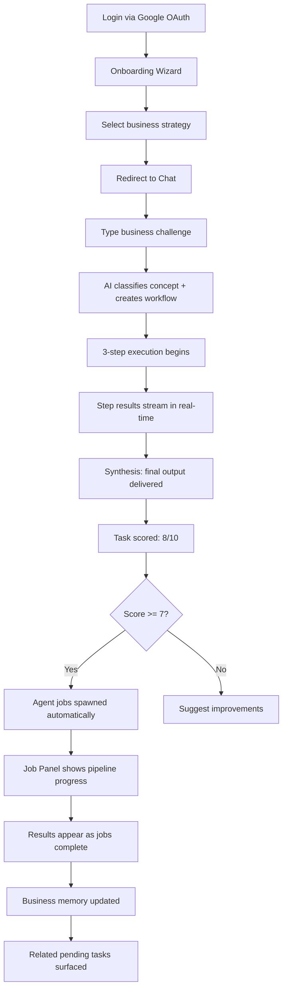
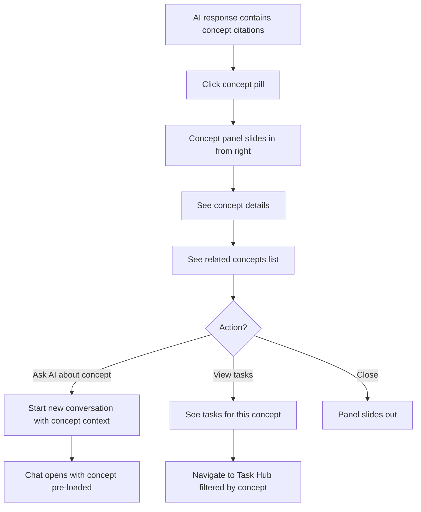

# UX Design Specification - Mentor AI (V2)

**Author:** Tanjav
**Original Date:** 2026-02-04
**V2 Revision:** 2026-03-07

---

## Executive Summary

### Project Vision

Mentor AI is an Autonomous Business Brain platform that executes business tasks across all functions using AI agents trained on 548 proprietary business concepts (organized into 16 cognitive domains). The platform delivers productivity gains through multi-agent orchestration, concept-based workflows, persistent business memory, and an ordered job pipeline that chains specialized agents (Web Search, Content, Marketing, Sales, Financial).

**Design Direction:** Modern black minimalist interface — a premium, focused "digital brain" aesthetic that differentiates from generic SaaS while positioning the platform as serious business intelligence.

**Current Platform Architecture:**
- **Single-tenant focus:** Platform Owner (Tanjav) uses the app directly; multi-tenant team features exist for future scaling
- **Concept-based AI:** 548 business concepts in 16 categories, matched via LLM classifier + semantic search
- **Agent Pipeline:** Ordered job execution — Web Search → Marketing → Content → Sales → Financial — via OpenClaw relay to DeepSeek
- **Business Memory:** Every conversation deposits insights into tenant-wide memory, injected into all future LLM prompts
- **Cloud Infrastructure:** DeepSeek (primary, via OpenClaw on Hetzner), GPT-4o-mini (fallback), Qdrant (vector DB), PostgreSQL on Neon

### Target User (Current)

| Persona | Profile | Core Need | Success Metric |
|---------|---------|-----------|----------------|
| **Tanjav** | Platform Owner & primary user | Execute business tasks via AI agents, build business knowledge, track task outcomes across all domains | Task completion quality (scored 7-9/10), growing business memory, efficient agent pipeline execution |

*Note: Multi-tenant personas (Business Owner, Team Member) exist in code but are not the current priority. The UX optimizes for the single power-user flow first.*

### Key Design Challenges

1. **Task Discoverability:** Tasks created from conversations disappear into concept trees. Users cannot find completed tasks or track what was done across domains.

2. **Navigation Fragmentation:** No shared app shell — each page has its own header/nav. Dashboard links differ from Chat links. Jarring transitions between pages.

3. **Agent Pipeline Visibility:** Multi-agent job execution (5 agents in sequence) takes 5-15 minutes. Users need real-time progress, not a blank screen.

4. **Language Chaos:** 24 components in Serbian, 15 in English. Registration, Settings, and 2FA are English while Login, Dashboard, and Chat are Serbian.

5. **Broken Component Styling:** 14 components use Tailwind utility classes in Angular inline templates — these don't render in Tailwind v4. Must be converted to pure CSS.

6. **Loading State Gaps:** Dashboard, Team, and Profile pages have no loading indicators. Users see blank content with no feedback.

### Design Opportunities

1. **Task Hub as Hero Feature:** A dedicated `/tasks` route showing all tasks grouped by domain, with status, scores, and agent execution results — solving the #1 usability pain point.

2. **Persistent App Shell:** Sidebar navigation visible on every page, providing consistent wayfinding and eliminating jarring page transitions.

3. **Agent Pipeline Visualization:** The Job Panel (`JobPanelComponent`) already shows real-time execution — promote this to a first-class UX pattern with better progress feedback.

4. **Business Memory as Differentiator:** The memory system (MemoryListComponent) lets users see what the AI has learned about their business — surface this prominently as a "Business Brain" feature.

5. **Dark Mode Excellence:** The `#0D0D0D` dark theme is already well-executed — polish it further for premium feel.

---

## Core User Experience

### Defining Experience

The core Mentor AI experience centers on **AI-driven task execution with autonomous agent orchestration**. Users describe business challenges in natural language; the AI classifies the topic, creates actionable tasks, scores outcomes, and chains specialized agents to deliver results.

**Primary User Action:** Describe a business challenge → AI creates tasks → Agents execute → Results delivered with scores
**Success Metric:** Tasks scored 7-9/10, growing business memory, faster decision-making
**Time to Value:** First meaningful task result within one conversation

### Platform Strategy

| Aspect | Decision | Rationale |
|--------|----------|-----------|
| **Primary Platform** | Web (Desktop-first) | Business productivity tool, complex task management |
| **Input Mode** | Text chat | Natural conversation with AI partner |
| **Output Mode** | Structured markdown + agent reports | Business documents, analyses, strategies |
| **Primary Language** | Serbian (Srpski) | Target market, user preference |
| **LLM Provider** | DeepSeek via OpenClaw relay | Primary model for all generation |
| **Fallback Model** | GPT-4o-mini | Scoring, classification, fast tasks |

### The Experience Loop

```
1. CHAT: User describes business challenge
     ↓
2. CLASSIFY: AI identifies concept domain + topic
     ↓
3. WORKFLOW: AI generates 3-step execution plan
     ↓
4. EXECUTE: Each step runs against LLM with business context
     ↓
5. SYNTHESIZE: Results combined into final output
     ↓
6. SCORE: AI evaluates quality (1-10) with justification
     ↓
7. AGENTS: If score ≥ 7, spawn specialized agent jobs (Web Search → Content → Marketing → etc.)
     ↓
8. LEARN: Business memory updated from conversation insights
     ↓
9. REPEAT: New tasks emerge from completed concept relationships
```

### Effortless Interactions

1. **Business Memory ("AI Already Knows")** — Every conversation deposits business insights into memory. Future responses are automatically informed by accumulated context.
2. **Concept Navigation** — Every `[[concept]]` link in AI responses opens the concept detail panel, showing related concepts and task history.
3. **Task Auto-Creation** — Completing a concept task automatically surfaces related pending tasks via the concept relationship graph.
4. **Agent Pipeline** — After task scoring, specialized agents (Web Search, Marketing, etc.) execute autonomously with real-time progress display.
5. **Topic Picker** — Quick selection of business domains to start focused conversations.

### Critical Success Moments

| Moment | Trigger | UX Response |
|--------|---------|-------------|
| **First Task Result** | Complete first conversation task | Show score, highlight what AI learned, surface next tasks |
| **Memory Recognition** | Return to familiar topic | AI references previous insights: "Based on your earlier analysis..." |
| **Agent Pipeline Complete** | All ordered jobs finish | Job Panel shows green checkmarks, results expandable inline |
| **Trust Building** | View task score + reasoning | Score breakdown with specific quality factors |
| **Discovery** | Click `[[concept]]` link | Concept panel slides in with related concepts and task history |
| **Business Growth** | Dashboard metrics | Show tasks completed, domains covered, memory depth |

### Experience Principles

1. **Transparency First** — Show task scores, source concepts, and active reasoning on every response. Include actionable improvement suggestions when scores are moderate.

2. **Memory as Superpower** — Business context persists and compounds. Every conversation makes the AI smarter about THIS business. Surface memory depth as a visible indicator of platform value.

3. **Dark & Focused** — Black minimalist aesthetic (`#0D0D0D` background) eliminates distraction, positions as premium business intelligence.

4. **Tasks as First-Class Citizens** — Tasks are the primary output of the platform. They must be discoverable, trackable, and organized — never buried in conversation threads.

5. **Agents Work Autonomously** — The AI pipeline executes without requiring user babysitting. Show progress, not blank screens. Let users do other things while agents work.

---

## Desired Emotional Response

### Primary Emotional Goals

| Emotion | Description | Why It Matters |
|---------|-------------|----------------|
| **Empowered** | "I can handle any business challenge" | Transforms capability, not just provides answers |
| **Confident** | "I'm making the right decision" | Task scores + business memory build trust |
| **Focused** | "Everything I need is right here" | Black minimalist UI eliminates distraction |
| **Productive** | "Look how much got done" | Agent pipeline delivers parallel results |
| **Supported** | "I have a partner, not a tool" | Business memory creates relationship feeling |

**Word-of-Mouth Emotion:** "It's like having a business brain that already knows my company and works 24/7. It doesn't just answer — it actually does the work."

### Emotional Journey Mapping

| Stage | Desired Emotion | What Creates It |
|-------|-----------------|-----------------|
| **First Discovery** | Intrigued + Curious | Dark premium UI signals serious tool |
| **Onboarding** | Quick validation | First task result within minutes |
| **First Task Score** | Impressed + Surprised | "8/10 — Here's why" with specific quality analysis |
| **Agent Pipeline** | Wonder + Relief | "5 agents working in parallel while I do other things" |
| **Repeated Use** | Trusted reliance | "It remembers my business context from last week" |
| **Task Hub Review** | Pride + Validation | "Look at everything that's been accomplished across all domains" |
| **Error/Failure** | Calm + Guided | Clear explanation + actionable recovery path |

### Micro-Emotions

**Emotions to Maximize:**
- Confidence — AI guidance feels trustworthy (scored results)
- Accomplishment — "I did that faster" (task completion)
- Discovery — "I didn't know these concepts connected" (relationship graph)
- Control — "I make the decisions" (human approves, AI executes)
- Professional pride — "This is serious business intelligence" (dark premium aesthetic)

**Emotions to Minimize:**
- Doubt — "Is this actually right?" → Show scores + reasoning
- Frustration — "Where did my tasks go?" → Task Hub solves this
- Overwhelm — "Too much happening" → Progressive disclosure
- Boredom — "Nothing is happening" → Agent pipeline progress indicators
- Confusion — "Why is this in English?" → Language consistency

### Design Implications

| Emotional Goal | UX Design Choice |
|----------------|------------------|
| **Empowered** | Task scores show quality, not just completion |
| **Confident** | Every result includes reasoning and business context |
| **Focused** | App Shell provides consistent navigation, reduces cognitive load |
| **Productive** | Job Pipeline shows parallel agent work in real-time |
| **Supported** | Memory list shows what AI has learned about the business |
| **Trust** | Scores, citations, transparent reasoning — never "trust me" |
| **Pride** | Task Hub shows cumulative accomplishments across domains |
| **Control** | Human starts tasks, AI executes — clear boundary |
| **Professional** | Premium typography, no playful animations, business tone |

### Emotional Design Principles

1. **"AI Executes, You Review"** — Every interaction reinforces human oversight. The AI performs work and presents results; the user evaluates quality. Never automate decisions without visibility.

2. **Proof Over Promises** — Build trust through evidence: task scores with reasoning, business memory citations, concept relationship chains. Never ask users to "just trust" the AI.

3. **Serious Business Aesthetic** — The dark minimalist UI signals professional-grade intelligence. No playful animations, no emoji overload, no gamification. This is a business brain, not a toy.

4. **Recovery with Dignity** — When agents fail or scores are low, explain clearly and offer actionable recovery. Never blame the user. Transform failures into improvement paths.

5. **Celebration of Progress** — Surface task counts, domain coverage, memory growth. Let users feel proud of what they've accomplished with the platform.

---

## App Shell Specification

### The Problem

Currently every page has its own header with different navigation links. The Dashboard header shows "Chat, Tim, Podešavanja". The Chat page has a completely different layout with sidebars. Settings pages have "Back" links. This creates:
- Jarring visual transitions between pages
- Users getting lost (no consistent "home" location)
- Duplicated navigation code across 13+ page components
- No persistent context (e.g., active conversation indicator)

### The Solution: Persistent App Shell

```
┌────────────────────────────────────────────────────────────────┐
│ [M] Mentor AI          [Search]          [?] [Bell] [Avatar]  │
├──────────┬─────────────────────────────────────────────────────┤
│          │                                                     │
│  NAV     │  PAGE CONTENT                                       │
│          │  (router-outlet)                                    │
│ ─────── │                                                     │
│ Dashboard│                                                     │
│ Chat     │                                                     │
│ Zadaci   │                                                     │
│ Memorija │                                                     │
│          │                                                     │
│ ─────── │                                                     │
│ Tim      │                                                     │
│ Podešav. │                                                     │
│          │                                                     │
│ ─────── │                                                     │
│ LLM      │  (Platform Owner only)                              │
│          │                                                     │
└──────────┴─────────────────────────────────────────────────────┘
```

### Shell Architecture

**Component:** `AppShellComponent` (new)
**Selector:** `app-shell`
**Structure:**
- Top bar (48px fixed): Logo, global search (future), notifications (future), user avatar + menu
- Left sidebar (220px, collapsible): Primary navigation with icons + labels
- Main content area: `<router-outlet>` for page content

**Navigation Items:**

| Label | Icon | Route | Description |
|-------|------|-------|-------------|
| Kontrolna tabla | lucideLayoutDashboard | `/dashboard` | Home — metrics, activity feed |
| Razgovori | lucideMessageSquare | `/chat` | Chat interface |
| Zadaci | lucideCheckSquare | `/tasks` | Task Hub (NEW) |
| Memorija | lucideBrain | `/memory` | Business memory management |
| Tim | lucideUsers | `/team` | Team management |
| Podešavanja | lucideSettings | `/settings` | Account + profile settings |
| LLM Konfiguracija | lucideCpu | `/admin/llm-config` | Platform Owner only |

**Sidebar Behavior:**
- Desktop (1280px+): Always visible, full labels
- Tablet (768-1279px): Collapsed to icons only, expand on hover
- Mobile (<768px): Hidden, hamburger toggle, overlay mode
- Active route highlighted with `--bg-elevated` + left accent border (2px, `--primary`)

**Sidebar Styling:**
```css
.shell-sidebar {
  width: 220px;
  background: #0D0D0D;
  border-right: 1px solid #2A2A2A;
  display: flex;
  flex-direction: column;
  padding: 12px 0;
}

.nav-item {
  display: flex;
  align-items: center;
  gap: 12px;
  padding: 10px 16px;
  color: #A1A1A1;
  font-size: 14px;
  border-radius: 6px;
  margin: 2px 8px;
  cursor: pointer;
  transition: background 150ms, color 150ms;
}

.nav-item:hover {
  background: #1A1A1A;
  color: #FAFAFA;
}

.nav-item.active {
  background: #1A1A1A;
  color: #FAFAFA;
  border-left: 2px solid #3B82F6;
}

.nav-section-divider {
  height: 1px;
  background: #2A2A2A;
  margin: 8px 16px;
}
```

### Top Bar

```
┌────────────────────────────────────────────────────────────────┐
│ [Logo] Mentor AI                                [Avatar ▾]    │
└────────────────────────────────────────────────────────────────┘
```

- Height: 48px, fixed top
- Background: `#0D0D0D`, border-bottom: 1px solid `#2A2A2A`
- Left: Logo mark + "Mentor AI" text (16px, 600 weight)
- Right: User avatar with dropdown (Profil, Podešavanja, Odjavi se)
- Clean, minimal — no clutter

### Page Integration

Each page component removes its own header/nav and becomes content-only. The App Shell wraps all authenticated routes:

```typescript
// app.routes.ts structure
{
  path: '',
  component: AppShellComponent,
  canActivate: [authGuard],
  children: [
    { path: 'dashboard', loadComponent: () => import('./features/dashboard/...') },
    { path: 'chat', loadComponent: () => import('./features/chat/...') },
    { path: 'chat/:conversationId', loadComponent: () => import('./features/chat/...') },
    { path: 'tasks', loadComponent: () => import('./features/tasks/...') },
    { path: 'memory', loadComponent: () => import('./features/memory/...') },
    { path: 'team', loadComponent: () => import('./features/team/...') },
    { path: 'settings', loadComponent: () => import('./features/settings/...') },
    { path: 'admin/llm-config', loadComponent: () => import('./features/platform-admin/...') },
    { path: '', redirectTo: 'dashboard', pathMatch: 'full' },
  ]
}
```

Public routes (login, register, callback, 2FA) remain outside the shell.

---

## Task Hub Specification

### The Problem

Tasks are created inside chat conversations and stored per-concept. Once created, they disappear into the concept tree sidebar. Users cannot:
- See all tasks across all domains in one place
- Find completed tasks from previous conversations
- Track which domains have active/pending work
- Understand overall business progress

### Task Hub Route: `/tasks`

```
┌──────────────────────────────────────────────────────────────────┐
│ SHELL SIDEBAR │  ZADACI (Tasks)                                  │
│               │                                                  │
│               │  [All] [Active] [Completed] [Pending]    [Filter]│
│               │                                                  │
│               │  ── Finansije (3 tasks) ────────────────────────  │
│               │  ┌─────────────────────────────────────────────┐ │
│               │  │ ✅ Analiza troškova Q1          Score: 8/10 │ │
│               │  │    Concept: Upravljanje troškovima          │ │
│               │  │    Completed: 2 dana ranije  │ View │ Jobs │ │
│               │  ├─────────────────────────────────────────────┤ │
│               │  │ 🔄 ROI projekcija za Q2         In Progress │ │
│               │  │    Concept: ROI analiza                     │ │
│               │  │    Agent: Financial ⏳ Running   │ View     │ │
│               │  ├─────────────────────────────────────────────┤ │
│               │  │ ⏳ Budžetski plan 2026           Pending    │ │
│               │  │    Concept: Budžetiranje                    │ │
│               │  │    Auto-created from: Upravljanje troškovima│ │
│               │  └─────────────────────────────────────────────┘ │
│               │                                                  │
│               │  ── Marketing (2 tasks) ────────────────────────  │
│               │  ┌─────────────────────────────────────────────┐ │
│               │  │ ✅ Konkurentska analiza tržišta  Score: 9/10│ │
│               │  │ ⏳ Content plan za social medije  Pending   │ │
│               │  └─────────────────────────────────────────────┘ │
│               │                                                  │
│               │  ── Prodaja (1 task) ───────────────────────────  │
│               │  ...                                             │
└──────────────────────────────────────────────────────────────────┘
```

### Task Card Anatomy

```
┌────────────────────────────────────────────────────────────────┐
│ [Status Icon] Task Title                    [Score Badge]      │
│ Concept: [[Concept Name]]                                     │
│ Created: timestamp  │  Conversation: link                     │
│ Agent Jobs: [🔍 Done] [📈 Running] [✏️ Pending] [💼 -] [💰 -] │
│                                              [View] [Re-run]  │
└────────────────────────────────────────────────────────────────┘
```

**Status Icons:**
- ✅ Completed (scored) — green accent
- 🔄 In Progress (executing) — blue accent with pulse animation
- ⏳ Pending (not started) — muted gray
- ❌ Failed — red accent

**Score Badge:**
- 8-10: Green background, white text
- 5-7: Amber background, dark text
- 1-4: Red background, white text
- No score: Gray, "—"

### Task Card Interactions

- **Click task** → Expand inline to show full result text (synthesized output)
- **Click "View"** → Navigate to the conversation where the task was created (`/chat/:conversationId`)
- **Click "Jobs"** → Expand to show Job Pipeline panel (agent execution status)
- **Click "Re-run"** → Re-execute the task workflow (confirmation modal first)
- **Click concept link** → Open concept detail in a slide-out panel

### Grouping & Filtering

**Default Grouping:** By domain (the 16 concept categories)
- Only show domains that have tasks (not all 16)
- Collapsed by default if all tasks in domain are completed
- Task count shown next to domain name

**Filter Bar:**
- All / Active / Completed / Pending — toggle buttons
- Domain filter dropdown (multi-select)
- Search by task title (debounced 300ms)
- Sort: Newest first (default), Score (high to low), Domain (alpha)

### Task Hub Summary Banner

At the top of the Task Hub, show aggregate metrics:

```
┌────────────────────────────────────────────────────────────────┐
│  📊 12 ukupno  │  ✅ 7 završeno  │  🔄 2 u toku  │  ⏳ 3 na čekanju  │
│  Prosečan skor: 7.8/10  │  Pokriveno domena: 5/16             │
└────────────────────────────────────────────────────────────────┘
```

### Empty State

When no tasks exist yet:
```
┌────────────────────────────────────────────────────────────────┐
│                                                                │
│              📋                                                │
│                                                                │
│     Još nema zadataka.                                         │
│     Započnite razgovor da kreirate svoj prvi zadatak.          │
│                                                                │
│     [Započni razgovor →]                                       │
│                                                                │
└────────────────────────────────────────────────────────────────┘
```

---

## Agent Job Pipeline UX

### Overview

When a task scores ≥ 7/10, the system spawns an ordered chain of agent jobs. Each agent type has specific capabilities and executes via OpenClaw relay (DeepSeek on Hetzner). The pipeline runs autonomously — the user observes progress and reviews results.

### Agent Types

| Agent | Icon | Label | Description | Tools |
|-------|------|-------|-------------|-------|
| WEB_SEARCH | 🔍 | Online istraživanje | Searches internet for relevant data | web_search, web_fetch, browser |
| CONTENT | ✏️ | Kreiranje sadržaja | Creates content with text + AI images | web_search, web_fetch, exec (fal-generate) |
| MARKETING | 📈 | Marketing analiza | Market analysis with AI visuals | web_search, web_fetch, exec |
| SALES | 💼 | Prodajna strategija | Sales plans + sends personalized emails | web_search, web_fetch, exec (agentmail-send) |
| FINANCIAL | 💰 | Finansijska analiza | ROI calculation, budget analysis | web_search, web_fetch |

### Job Panel Component (Existing: `JobPanelComponent`)

The Job Panel shows a vertical pipeline of ordered agent jobs:

```
┌────────────────────────────────────────────────────────────────┐
│ 🤖 AI Agenti za zadatak                                       │
│                                                                │
│ ┌──────────────────────────────────────────────────────────┐   │
│ │ 🔍 Online istraživanje                    ✅ Završeno    │   │
│ │ Trajanje: 2m 34s                          [Prikaži ▾]   │   │
│ └──────────────────────────────────────────────────────────┘   │
│       │                                                        │
│ ┌──────────────────────────────────────────────────────────┐   │
│ │ 📈 Marketing analiza                      🔄 Izvršava se │   │
│ │ ████████████░░░░░░░░  ~3 min remaining    [Prikaži ▾]   │   │
│ └──────────────────────────────────────────────────────────┘   │
│       │                                                        │
│ ┌──────────────────────────────────────────────────────────┐   │
│ │ ✏️ Kreiranje sadržaja                      ⏳ Na čekanju  │   │
│ └──────────────────────────────────────────────────────────┘   │
│       │                                                        │
│ ┌──────────────────────────────────────────────────────────┐   │
│ │ 💼 Prodajna strategija                     ⏳ Na čekanju  │   │
│ └──────────────────────────────────────────────────────────┘   │
│       │                                                        │
│ ┌──────────────────────────────────────────────────────────┐   │
│ │ 💰 Finansijska analiza                     ⏳ Na čekanju  │   │
│ └──────────────────────────────────────────────────────────┘   │
│                                                                │
│ Ukupan budžet: €2.50 / €5.00 dnevno                           │
└────────────────────────────────────────────────────────────────┘
```

### Job States & Visual Treatment

| State | Label | Icon | Background | Animation |
|-------|-------|------|------------|-----------|
| PENDING | Na čekanju | ⏳ | `#1A1A1A` | None |
| RUNNING | Izvršava se | 🔄 | `#1A1A1A` + left blue border | Pulse on icon |
| COMPLETED | Završeno | ✅ | `#1A1A1A` + left green border | Brief success flash |
| FAILED | Neuspešno | ❌ | `#1A1A1A` + left red border | None |
| SKIPPED | Preskočeno | ⏭️ | `#1A1A1A` | Dimmed 50% |

### Job Result Display

When a job completes, clicking "Prikaži" expands to show:

```
┌──────────────────────────────────────────────────────────────┐
│ 🔍 Online istraživanje                        ✅ Završeno    │
│──────────────────────────────────────────────────────────────│
│                                                              │
│ [Rendered markdown output from agent]                        │
│                                                              │
│ Including tables, images, source links...                    │
│                                                              │
│──────────────────────────────────────────────────────────────│
│ Trajanje: 2m 34s  │  Troškovi: €0.50  │  Tokens: 12,847    │
└──────────────────────────────────────────────────────────────┘
```

- Agent output rendered as rich markdown (tables, images, links)
- NO code blocks or HTML tags in output (agents instructed to use clean markdown)
- Images displayed inline via `` syntax
- Source URLs rendered as clickable links

### Error Handling in Pipeline

When a job fails:
- Show error message in expandable panel
- Offer "Ponovo pokreni" (Retry) button
- Pipeline continues with remaining jobs (non-blocking)
- Failed job marked red, but subsequent jobs still execute

### Budget Display

The Job Panel footer shows daily budget consumption:
- Progress bar: consumed / daily limit
- Color: Green (<50%), Amber (50-80%), Red (>80%)
- Per-job cost shown in expanded view
- Warning toast when approaching daily limit

---

## Business Memory UX

### Memory Route: `/memory`

Business memories are insights the AI extracts from conversations and uses to inform all future responses. This page lets users view, filter, and correct what the AI has learned.

```
┌──────────────────────────────────────────────────────────────────┐
│ SHELL SIDEBAR │  MEMORIJA POSLOVANJA                              │
│               │                                                   │
│               │  [Sve] [Činjenice] [Preferencije] [Kontekst]      │
│               │                                                   │
│               │  📊 47 memorija ukupno  │  Poslednja: pre 2h     │
│               │                                                   │
│               │  ┌─────────────────────────────────────────────┐  │
│               │  │ 💡 "Kompanija se bavi pakovanjem i logist..." │  │
│               │  │    Tip: Činjenica  │  Izvor: Razgovor #12    │  │
│               │  │    Kreirano: 5. mart 2026                    │  │
│               │  │                              [✏️] [🗑️]       │  │
│               │  ├─────────────────────────────────────────────┤  │
│               │  │ 💡 "Preferirani kanal komunikacije je email" │  │
│               │  │    Tip: Preferencija  │  Izvor: Razgovor #8  │  │
│               │  │    Kreirano: 28. feb 2026                    │  │
│               │  │                              [✏️] [🗑️]       │  │
│               │  └─────────────────────────────────────────────┘  │
│               │                                                   │
│               │  Memory Depth: ████████████░░░ 47/100            │
│               │  "Vaš AI poslovni mozak raste sa svakim           │
│               │   razgovorom."                                    │
└──────────────────────────────────────────────────────────────────┘
```

### Memory Card Interactions

- **Click edit (✏️)** → Opens correction dialog with current text editable
- **Click delete (🗑️)** → Confirmation modal: "Da li ste sigurni?"
- **Click source link** → Navigate to the originating conversation

### Memory Depth Indicator

A visual progress bar showing how much the AI has learned:
- 0-10 memories: "Početak" — faint glow
- 11-30 memories: "Raste" — moderate glow
- 31-60 memories: "Snažno" — strong glow
- 60+ memories: "Duboko" — full glow with star

This indicator also appears in the App Shell sidebar as a small badge next to "Memorija".

---

## Design System Foundation

### Technology Stack

| Layer | Technology | Notes |
|-------|-----------|-------|
| **Framework** | Angular 21, Standalone Components | Signals for reactivity, OnPush change detection |
| **Styling** | Pure CSS in `styles` blocks | Tailwind v4 does NOT process classes in inline templates |
| **Icons** | Lucide via `@ng-icons/core` | Inline SVGs as fallback where needed |
| **Buttons** | Native `<button>` elements | NOT Spartan-NG BrnButton (doesn't render) |
| **State** | Angular Signals | No NgRx — signals + services |
| **Real-time** | Socket.io at `/ws/chat` | WebSocket for chat + job updates |
| **LLM Primary** | DeepSeek via OpenClaw relay | Hetzner CX22, Tailscale Funnel |
| **LLM Fallback** | GPT-4o-mini via OpenAI API | Scoring, classification |
| **Vector DB** | Qdrant (cloud) | OpenAI text-embedding-3-small, 1536-dim |
| **Database** | PostgreSQL on Neon | Prisma ORM |

### CRITICAL: Styling Rule (ADR-001)

**Tailwind CSS v4 does NOT process utility classes in Angular inline templates.** All components MUST use pure CSS class definitions in the `styles` block.

**WRONG:**
```html
<div class="flex items-center bg-gray-900 p-4 rounded-lg">
```

**CORRECT:**
```typescript
@Component({
  template: `<div class="container">...</div>`,
  styles: [`
    .container {
      display: flex;
      align-items: center;
      background: #1A1A1A;
      padding: 16px;
      border-radius: 8px;
    }
  `]
})
```

### Components Requiring CSS Fix (14 total)

The following components currently use Tailwind utility classes in inline templates and must be converted to pure CSS:

| Component | File | Priority |
|-----------|------|----------|
| OAuthPendingComponent | `auth/oauth-pending.component.ts` | Medium |
| InviteAcceptComponent | `team/invite-accept.component.ts` | Medium |
| AccountSettingsComponent | `account-settings/account-settings.component.ts` | High |
| ProfileSettingsComponent | `profile-settings/profile-settings.component.ts` | High |
| DesignateDialogComponent | `account-settings/designate-dialog.component.ts` | Medium |
| DeleteWorkspaceDialogComponent | `account-settings/delete-workspace-dialog.component.ts` | Medium |
| ExportSectionComponent | `profile-settings/export-section.component.ts` | Medium |
| IndustrySelectComponent | `registration/industry-select.component.ts` | Low |
| FileUploadPreviewComponent | `registration/file-upload-preview.component.ts` | Low |
| ConversationNotesComponent | `chat/conversation-notes.component.ts` | High (hybrid) |
| MemoryListComponent | `chat/memory-list.component.ts` | High (hybrid) |
| MemoryCorrectionDialogComponent | `chat/memory-correction-dialog.component.ts` | Medium |

### Color System

**Core Palette (Dark Theme):**

| Token | Value | Usage |
|-------|-------|-------|
| `--bg-base` | `#0D0D0D` | App background |
| `--bg-surface` | `#1A1A1A` | Cards, panels, elevated surfaces |
| `--bg-elevated` | `#242424` | Hover states, active items |
| `--border-subtle` | `#2A2A2A` | Dividers, panel borders |
| `--border-default` | `#3A3A3A` | Input borders, separators |
| `--text-primary` | `#FAFAFA` | Headings, primary content |
| `--text-secondary` | `#A1A1A1` | Labels, secondary content |
| `--text-muted` | `#6B6B6B` | Placeholders, timestamps |

**Semantic Colors:**

| Token | Value | Usage |
|-------|-------|-------|
| `--success` | `#22C55E` | High scores (8-10), completed tasks |
| `--warning` | `#EAB308` | Moderate scores (5-7), in-progress |
| `--error` | `#EF4444` | Low scores (1-4), failures |
| `--info` | `#3B82F6` | Information, primary actions |

**Agent Pipeline Colors:**

| Agent | Color | Hex |
|-------|-------|-----|
| Web Search | Blue | `#3B82F6` |
| Content | Purple | `#8B5CF6` |
| Marketing | Green | `#10B981` |
| Sales | Orange | `#F59E0B` |
| Financial | Amber | `#D97706` |

### Typography System

**Font Stack:**
- Primary: `Inter` (clean, modern, excellent screen readability)
- Monospace: `JetBrains Mono` (code blocks, technical content)
- Fallback: `system-ui, -apple-system, sans-serif`

**Type Scale:**

| Level | Size | Weight | Line Height | Usage |
|-------|------|--------|-------------|-------|
| Display | 32px | 600 | 1.2 | Dashboard hero metrics |
| H1 | 24px | 600 | 1.3 | Page titles |
| H2 | 20px | 600 | 1.35 | Section headers |
| H3 | 16px | 600 | 1.4 | Card titles, panel headers |
| Body | 15px | 400 | 1.6 | Chat messages, AI responses |
| Small | 13px | 400 | 1.4 | Labels, timestamps, inline links |
| Tiny | 11px | 500 | 1.3 | Keyboard shortcuts, hints |

### Spacing System (8px base)

| Token | Value | Usage |
|-------|-------|-------|
| `--space-1` | 4px | Tight gaps, inline elements |
| `--space-2` | 8px | Component internal padding |
| `--space-3` | 12px | Related element spacing |
| `--space-4` | 16px | Card padding, section gaps |
| `--space-5` | 24px | Panel padding, major sections |
| `--space-6` | 32px | Page margins, hero areas |
| `--space-8` | 48px | Large section separation |

### Interaction States

| State | Visual Change |
|-------|---------------|
| Default | As specified per component |
| Hover | Background lightens to `--bg-elevated` |
| Active | Background darkens 5% from hover |
| Focus | 2px ring with `--info` color (`#3B82F6`) |
| Disabled | 40% opacity, no pointer events |
| Loading | Spinner replaces content, dimensions preserved |

---

## Language Strategy

### Decision: Serbian (Srpski) Throughout

All user-facing text must be in Serbian. This includes:
- Page titles, labels, and navigation
- Button text and form labels
- Empty states and helper text
- Error messages and confirmations
- Toast notifications
- Placeholder text

### Components Requiring Language Fix

The following components currently display English text and must be converted to Serbian:

| Component | Current Language | Priority |
|-----------|-----------------|----------|
| CallbackComponent | English | Medium |
| RegistrationComponent | English | High |
| OAuthPendingComponent | English | Medium |
| InviteAcceptComponent | English | Medium |
| TwoFactorSetupComponent | English | Medium |
| TwoFactorVerifyComponent | English | Medium |
| AccountSettingsComponent | English | High |
| ProfileSettingsComponent | English | High |
| MemoryAttributionComponent | English | Medium |
| ConfidenceIndicatorComponent | English | Low |
| PersonaSelectorComponent | English | Low |
| PersonaBadgeComponent | English | Low |
| MemoryListComponent | English | High |
| MemoryCorrectionDialogComponent | English | Medium |
| ExportSectionComponent | English | Medium |
| IndustrySelectComponent | English | Low |
| FileUploadPreviewComponent | English | Low |
| DesignateDialogComponent | English | Medium |
| DeleteWorkspaceDialogComponent | English | Medium |
| DiscoveryChatComponent | English | Medium |

### Common Translations Reference

| English | Serbian |
|---------|---------|
| Dashboard | Kontrolna tabla |
| Tasks | Zadaci |
| Chat | Razgovori |
| Settings | Podešavanja |
| Team | Tim |
| Memory | Memorija |
| Search | Pretraži |
| Save | Sačuvaj |
| Cancel | Otkaži |
| Delete | Obriši |
| Edit | Izmeni |
| View | Prikaži |
| Loading... | Učitava se... |
| Error | Greška |
| Success | Uspešno |
| Confirm | Potvrdi |
| Back | Nazad |
| Next | Dalje |
| Submit | Pošalji |
| Score | Ocena |
| Completed | Završeno |
| In Progress | U toku |
| Pending | Na čekanju |
| Failed | Neuspešno |
| Retry | Ponovo |
| Sign In | Prijavi se |
| Sign Out | Odjavi se |
| Profile | Profil |
| Export | Izvoz |
| Import | Uvoz |

---

## User Journey Flows

### Journey 1: First Task Execution (New User)

**Goal:** Complete first business task within one conversation



**Key UX Moments:**
1. **Onboarding is minimal** — strategy selection, then straight to chat
2. **Real-time streaming** — step results appear as they're generated
3. **Score as validation** — "8/10" confirms quality, builds trust
4. **Agent pipeline is automatic** — no manual trigger needed
5. **Memory feedback** — "Zapamtio sam: [insight]" confirms AI is learning

### Journey 2: Task Hub Review

**Goal:** Review all completed tasks, find specific results, track progress

```mermaid
flowchart TD
    A[Click "Zadaci" in sidebar] --> B[Task Hub loads]
    B --> C[Summary banner: 12 tasks, avg 7.8]
    C --> D{Filter needed?}
    D -->|By domain| E[Select "Finansije" filter]
    D -->|By status| F[Toggle "Completed" tab]
    D -->|Search| G[Type task keyword]
    E --> H[3 finance tasks shown]
    F --> H
    G --> H
    H --> I[Click task card to expand]
    I --> J[View full result text]
    J --> K{Action?}
    K -->|View jobs| L[Expand Job Pipeline]
    K -->|Go to chat| M[Navigate to conversation]
    K -->|Re-run| N[Confirmation → re-execute]
    L --> O[See agent results inline]
```

**Key UX Moments:**
1. **Summary banner** — immediate overview of total work done
2. **Domain grouping** — natural organization by business area
3. **Inline expansion** — results visible without page navigation
4. **Job Pipeline access** — agent results accessible from task card

### Journey 3: Agent Pipeline Monitoring

**Goal:** Monitor autonomous agent execution and review results

```mermaid
flowchart TD
    A[Task scored 8/10] --> B[Job Panel appears]
    B --> C[Web Search agent starts]
    C --> D[Progress: "Izvršava se..."]
    D --> E[Web Search completes ✅]
    E --> F[Marketing agent starts]
    F --> G[User can browse other pages]
    G --> H[Return to chat later]
    H --> I[Job Panel shows: 3/5 done]
    I --> J[All jobs complete]
    J --> K[Expand each result]
    K --> L[Review markdown output]
    L --> M{Satisfied?}
    M -->|Yes| N[Continue to next topic]
    M -->|No| O[Click "Ponovo" to retry specific job]
```

**Key UX Moments:**
1. **Non-blocking** — user can navigate away during execution
2. **Progress persistence** — Job Panel state maintained across navigation
3. **Per-job results** — each agent's output independently expandable
4. **Selective retry** — retry individual failed jobs, not entire pipeline

### Journey 4: Memory Management

**Goal:** Review and correct what the AI has learned about the business

```mermaid
flowchart TD
    A[Click "Memorija" in sidebar] --> B[Memory list loads]
    B --> C[47 memories displayed]
    C --> D{Action?}
    D -->|Filter| E[Select "Činjenice" tab]
    D -->|Search| F[Type keyword]
    D -->|Edit| G[Click ✏️ on memory]
    D -->|Delete| H[Click 🗑️ on memory]
    E --> I[Filtered list shown]
    G --> J[Correction dialog opens]
    J --> K[Edit memory text]
    K --> L[Save → memory updated]
    H --> M[Confirmation modal]
    M --> N[Memory deleted]
```

### Journey 5: Concept Discovery

**Goal:** Explore connected business concepts from chat responses



---

## Component Strategy

### Current Component Inventory (39 total)

**Page Components (13):**

| Component | Status | Styling | Language | Loading Indicator |
|-----------|--------|---------|----------|-------------------|
| LoginComponent | Working | Pure CSS | Serbian | Spinner during sign-in |
| CallbackComponent | Working | Pure CSS | English | Spinner on load |
| RegistrationComponent | Working | Pure CSS | English | Error handling |
| OAuthPendingComponent | BROKEN | Tailwind | English | Spinner |
| InviteAcceptComponent | BROKEN | Tailwind | English | Spinner |
| OnboardingWizardComponent | Working | Pure CSS | Serbian | Progress circles |
| DashboardComponent | Working | Pure CSS | Serbian | NONE |
| TeamComponent | Working | Pure CSS | Serbian | NONE |
| AccountSettingsComponent | BROKEN | Tailwind | English | Spinner |
| ProfileSettingsComponent | BROKEN | Tailwind | English | NONE |
| LlmConfigComponent | Working | Pure CSS | Serbian | Spinner |
| ChatComponent | Working | Pure CSS | Serbian | Typing indicator |
| TwoFactorSetupComponent | Working | Pure CSS | English | Spinner |

**Chat Sub-Components (10):**

| Component | Status | Purpose |
|-----------|--------|---------|
| ChatInputComponent | Working | Message input + file upload |
| ChatMessageComponent | Working | Message bubble with citations |
| TypingIndicatorComponent | Working | Animated dots + persona badge |
| ConceptTreeComponent | Working | Sidebar concept hierarchy |
| ConversationNotesComponent | Partial | Notes + task execution (hybrid CSS) |
| TopicPickerComponent | Working | Business topic selection modal |
| FeatureTourComponent | Working | Onboarding guide overlay |
| DiscoveryChatComponent | Working | Discovery mode overlay |
| JobPanelComponent | Working | Agent job pipeline tracker |
| PdfReorderDialogComponent | Working | PDF page drag-drop |

**Support Components (16):**

| Component | Status | Purpose |
|-----------|--------|---------|
| ConceptCitationComponent | Working | Citation badge in messages |
| MemoryAttributionComponent | Working | "Based on..." expandable |
| ConfidenceIndicatorComponent | Working | Color-coded confidence badge |
| ConceptPanelComponent | Working | Right slide-out detail panel |
| PersonaSelectorComponent | Working | Persona grid (skeleton loading) |
| PersonaBadgeComponent | Working | Small persona color badge |
| InviteDialogComponent | Working | Team invite modal |
| RemoveDialogComponent | Working | Team member remove modal |
| DesignateDialogComponent | BROKEN | Tailwind — backup owner modal |
| DeleteWorkspaceDialogComponent | BROKEN | Tailwind — delete workspace modal |
| MemoryListComponent | Partial | Memory management (hybrid CSS) |
| MemoryCorrectionDialogComponent | Working | Memory edit dialog |
| ExportSectionComponent | BROKEN | Tailwind — data export |
| IndustrySelectComponent | BROKEN | Tailwind — industry dropdown |
| FileUploadPreviewComponent | BROKEN | Tailwind — upload preview |

### New Components Needed

| Component | Route/Location | Priority | Purpose |
|-----------|---------------|----------|---------|
| **AppShellComponent** | Root layout | P0 | Persistent sidebar + top bar for all authenticated routes |
| **TaskHubComponent** | `/tasks` | P0 | Task list grouped by domain with filtering |
| **TaskCardComponent** | Task Hub child | P0 | Individual task display with score, status, expansion |
| **TaskSummaryBannerComponent** | Task Hub header | P1 | Aggregate metrics (total, completed, avg score) |
| **MemoryPageComponent** | `/memory` | P1 | Standalone page wrapping MemoryListComponent |
| **BusyOverlayComponent** | Shared utility | P1 | Reusable full-page/section skeleton loader |

### Component Implementation Priority

**Phase 1 — Critical Path (App Shell + Task Hub):**
1. AppShellComponent — persistent navigation
2. TaskHubComponent — task discovery
3. TaskCardComponent — task display
4. Fix 5 high-priority broken components (AccountSettings, ProfileSettings, ConversationNotes, MemoryList, RegistrationComponent)

**Phase 2 — Polish:**
1. TaskSummaryBannerComponent
2. MemoryPageComponent (standalone route)
3. BusyOverlayComponent (reusable skeleton)
4. Fix remaining 9 broken components
5. Language conversion for 20 English components
6. Dashboard redesign (dynamic content)

**Phase 3 — Enhancement:**
1. Onboarding walkthrough improvements
2. Toast notification system (global)
3. Keyboard shortcuts implementation
4. Mobile responsive improvements

---

## UX Consistency Patterns

### Loading & Busy Indicators

**Rule:** Every async operation must have a visible loading indicator.

| Wait Duration | Pattern | Implementation |
|---------------|---------|----------------|
| < 1 second | Inline spinner in button/element | `@keyframes spin` on small circle |
| 1-3 seconds | Content area skeleton | Shimmer animation on placeholder cards |
| 3-10 seconds | Skeleton + estimated time | "Učitava se... ~5 sekundi" |
| > 10 seconds | Progress bar + time remaining | Agent pipeline progress with "~3 min preostalo" |

**Pages Currently Missing Loading Indicators (must fix):**

| Page | What's Missing | Solution |
|------|---------------|----------|
| DashboardComponent | No loading on initial data fetch | Add skeleton cards for metrics |
| TeamComponent | No loading on team member list | Add skeleton rows |
| ProfileSettingsComponent | No loading on profile data fetch | Add form skeleton |

### Task State Display

Consistent visual language for task states across Task Hub, Job Panel, and Chat:

| State | Icon | Color | Background Accent |
|-------|------|-------|-------------------|
| Pending | ⏳ | `#6B6B6B` (muted) | None |
| In Progress | 🔄 | `#3B82F6` (info) | Left border blue |
| Completed | ✅ | `#22C55E` (success) | Left border green |
| Failed | ❌ | `#EF4444` (error) | Left border red |
| Skipped | ⏭️ | `#6B6B6B` (muted) | Dimmed 50% |

### Score Display

Consistent score badge across all contexts:

| Score Range | Background | Text | Label |
|-------------|------------|------|-------|
| 8-10 | `#22C55E` | White | Odlično |
| 5-7 | `#EAB308` | `#0D0D0D` | Prosečno |
| 1-4 | `#EF4444` | White | Slabo |
| None | `#3A3A3A` | `#A1A1A1` | — |

### Navigation Patterns

**Sidebar Navigation (App Shell):**
- Active route: `#1A1A1A` background + 2px left blue border
- Hover: `#1A1A1A` background
- Icon + label always visible on desktop
- Section dividers between nav groups

**Breadcrumb (within pages):**
- Chat context: Show active conversation name
- Task detail: "Zadaci > [Domain] > [Task Name]"
- Maximum 3 levels, older levels truncated

### AI Response Display

**Chat Message Anatomy (existing, documented for consistency):**

```
┌────────────────────────────────────────────────────────────┐
│ [Persona Badge]  AI Mentor                    [timestamp]  │
│────────────────────────────────────────────────────────────│
│                                                            │
│ Response text with [[Concept Name]] as citation pills      │
│ rendered as inline badges with concept panel on click.     │
│                                                            │
│────────────────────────────────────────────────────────────│
│ Concepts: [Pricing Strategy] [Value Proposition]           │
│ Based on: "Your earlier analysis of..." (expandable)       │
└────────────────────────────────────────────────────────────┘
```

### Button Hierarchy

| Type | Background | Border | Text | Usage |
|------|-----------|--------|------|-------|
| Primary | `#3B82F6` | None | White | Main CTA (one per screen) |
| Secondary | Transparent | `#3A3A3A` | `#FAFAFA` | Alternative actions |
| Ghost | Transparent | None | `#A1A1A1` | Tertiary actions |
| Destructive | `#EF4444` | None | White | Delete, Remove (always with confirmation) |

### Empty States

Every empty state must include:
1. A relevant icon (not generic)
2. Descriptive message in Serbian explaining what will appear
3. A call-to-action if the user can take action

**Examples:**
- Empty chat: "Spremni za novi poslovni izazov? Opišite ga ispod."
- Empty task hub: "Još nema zadataka. Započnite razgovor da kreirate svoj prvi zadatak."
- Empty memory: "Memorija je prazna. AI će automatski zapamtiti važne informacije iz vaših razgovora."

### Error Handling

| Error Type | Display | Recovery |
|------------|---------|----------|
| API failure | Toast with specific error | "Ponovo" retry button |
| WebSocket disconnect | Top banner: "Ponovno povezivanje..." | Auto-retry with countdown |
| Agent job failure | Red border in Job Panel | Per-job "Ponovo pokreni" button |
| Form validation | Inline below field, red text | Fix input and resubmit |
| Auth failure | Full-screen with redirect | "Prijavite se ponovo" button |

### Modal & Dialog Patterns

| Type | Size | Backdrop | Dismiss |
|------|------|----------|---------|
| Confirmation | 400px max-width | Dark overlay | Escape, click outside, Cancel button |
| Topic Picker | 600px max-width | Dark overlay | Escape, click outside |
| Memory Correction | 500px max-width | Dark overlay | Escape, Cancel button |
| Concept Panel | 360px, slides from right | No overlay (pushes content) | X button, Escape |

---

## Responsive Design & Accessibility

### Responsive Strategy

**Device Priority:** Desktop (primary) > Tablet (secondary) > Mobile (tertiary)

**Desktop (1280px+):**
- Full App Shell with expanded sidebar (220px)
- Chat: Three-panel layout (sidebar + chat + concept panel)
- Task Hub: Full card grid with inline expansion
- All features available

**Tablet (768-1279px):**
- App Shell with collapsed sidebar (icons only, 56px)
- Chat: Two-panel (sidebar collapsed, concept panel as overlay)
- Task Hub: Stacked cards, single column
- Touch-optimized: 48px minimum touch targets

**Mobile (<768px):**
- App Shell sidebar hidden, hamburger toggle
- Chat: Single panel, full-width
- Task Hub: Compact cards, scrollable list
- Bottom-of-viewport input for chat

### Breakpoints

| Breakpoint | Name | Shell Sidebar | Chat Layout |
|------------|------|---------------|-------------|
| < 640px | Mobile S | Hidden | Single panel |
| 640-767px | Mobile L | Hidden | Single panel |
| 768-1023px | Tablet | Icons only (56px) | Two panel |
| 1024-1279px | Desktop S | Icons only (56px) | Two panel + right overlay |
| 1280-1535px | Desktop M | Full (220px) | Three panel |
| >= 1536px | Desktop L | Full (220px) | Three panel, max-width |

### Accessibility

**Compliance Target:** WCAG 2.1 Level AA

**Color Contrast:**

| Element | Requirement | Value |
|---------|-------------|-------|
| Primary text (#FAFAFA on #0D0D0D) | 4.5:1 minimum | 15.8:1 |
| Secondary text (#A1A1A1 on #0D0D0D) | 4.5:1 minimum | 7.2:1 |
| All interactive elements | 4.5:1 minimum | All meet |

**Keyboard Navigation:**
- All interactive elements focusable via Tab
- Logical tab order following visual layout
- Skip links: "Preskoči na sadržaj"
- Escape closes modals/overlays and returns focus to trigger
- Arrow keys navigate within component groups (task cards, nav items)

**Screen Reader:**
- Semantic HTML: `<main>`, `<nav>`, `<aside>`, `<article>`
- ARIA landmarks for App Shell regions
- `aria-live="polite"` for streaming AI responses
- Descriptive labels for all interactive elements
- Status announcements for task/job state changes

**Focus Management:**
- Visible focus ring: 2px solid `#3B82F6`
- Focus trapped in modals until dismissed
- Focus returns to trigger element after modal close

**Reduced Motion:**
```css
@media (prefers-reduced-motion: reduce) {
  *, *::before, *::after {
    animation-duration: 0.01ms !important;
    transition-duration: 0.01ms !important;
  }
}
```

---

## Dashboard Redesign

### Current Problem

The Dashboard is a **static persona selection grid** — 6 persona cards that just navigate to Chat. No dynamic data, no activity feed, no progress metrics. It's essentially a fancy menu.

### Redesigned Dashboard: Command Center

```
┌──────────────────────────────────────────────────────────────────┐
│ SHELL SIDEBAR │  KONTROLNA TABLA                                  │
│               │                                                   │
│               │  ┌──────────┬──────────┬──────────┬───────────┐  │
│               │  │ 📊 12    │ ✅ 7     │ 🔄 2     │ ⏳ 3      │  │
│               │  │ Zadataka │ Završeno │ U toku   │ Na čekanju│  │
│               │  └──────────┴──────────┴──────────┴───────────┘  │
│               │                                                   │
│               │  ── Nedavna aktivnost ──────────────────────────  │
│               │  ┌─────────────────────────────────────────────┐  │
│               │  │ 🔍 Web Search završen za "Analiza tržišta"  │  │
│               │  │    pre 5 minuta  │  Score: 8/10             │  │
│               │  ├─────────────────────────────────────────────┤  │
│               │  │ 💡 Nova memorija: "Ciljno tržište je B2B"   │  │
│               │  │    pre 23 minuta                            │  │
│               │  ├─────────────────────────────────────────────┤  │
│               │  │ ✅ Zadatak završen: "ROI projekcija Q2"     │  │
│               │  │    pre 1 sat  │  Score: 9/10               │  │
│               │  └─────────────────────────────────────────────┘  │
│               │                                                   │
│               │  ── Brzi početak ───────────────────────────────  │
│               │  ┌────────────┐ ┌────────────┐ ┌────────────┐   │
│               │  │ 📈 Marketing│ │ 💰 Finansije│ │ 💼 Prodaja │   │
│               │  │ 3 zadatka  │ │ 2 zadatka  │ │ 1 zadatak  │   │
│               │  └────────────┘ └────────────┘ └────────────┘   │
│               │                                                   │
│               │  ── Memorija ───────────────────────────────────  │
│               │  Dubina: ████████████░░░ 47 memorija             │
│               │  Poslednja: pre 2 sata                           │
│               │                                                   │
│               │  [+ Novi razgovor]                                │
└──────────────────────────────────────────────────────────────────┘
```

### Dashboard Sections

1. **Summary Cards (top)** — 4 metric cards showing task totals by status. Clickable to navigate to Task Hub with that filter.

2. **Recent Activity Feed** — Last 5-10 events: completed tasks, new memories, agent job completions. Each item clickable to navigate to source.

3. **Quick Start Domain Cards** — Top 3-4 domains with active tasks. Click to start new conversation in that domain.

4. **Memory Depth** — Visual progress bar showing business memory growth. Clickable to navigate to `/memory`.

5. **CTA Button** — "Novi razgovor" prominently placed for quick access to chat.

---

## Onboarding & First-Time Experience

### Onboarding Wizard (Existing)

The current OnboardingWizardComponent provides a multi-step strategy selection. This should remain but be enhanced:

1. **Step 1:** Welcome + company name/industry (existing)
2. **Step 2:** Select business strategy focus (existing)
3. **Step 3:** Quick tour overlay highlighting App Shell navigation (NEW)
4. **Step 4:** First guided conversation with pre-populated prompt (NEW)

### Feature Tour Enhancement

The existing FeatureTourComponent should be expanded to cover:

| Tour Stop | Element | Tooltip Text |
|-----------|---------|-------------|
| 1 | Sidebar "Razgovori" | "Ovde započinjete razgovore sa AI-jem" |
| 2 | Sidebar "Zadaci" | "Svi vaši zadaci će biti ovde — grupisani po oblastima" |
| 3 | Sidebar "Memorija" | "AI pamti važne informacije o vašem poslovanju" |
| 4 | Chat input | "Opišite poslovni izazov i AI će kreirati zadatke" |
| 5 | Concept tree (sidebar) | "Poslovni koncepti su organizovani u 16 oblasti" |

### Tour Behavior

- Displays on first login after onboarding completion
- Spotlight effect: dims everything except target element
- Progress dots at bottom (1/5, 2/5, etc.)
- "Preskoči" (Skip) link at bottom-right
- "Dalje" (Next) button to advance
- Completed state saved in user preferences (never shows again)

---

## Future Features Appendix

*The following features were in the V1 spec but are not currently implemented. They remain part of the long-term vision and will be specified in detail when development begins.*

### Knowledge Graph Visualization
- **V1 Spec:** Sigma.js (WebGL) graph with LOD labels, physics-based positioning, Obsidian-style dark glowing nodes
- **Current State:** No graph component exists. ConceptTreeComponent is text-based
- **When:** After core UX (App Shell, Task Hub) is solid

### Voice Input/Output
- **V1 Spec:** Whisper STT for input, Azure TTS for output, per-persona voice mapping
- **Current State:** No voice features exist
- **When:** Post-MVP enhancement

### Image Generation in Chat
- **V1 Spec:** DALL-E API for inline image generation
- **Current State:** Agent pipeline uses fal-generate, but results appear in Job Panel, not inline chat
- **When:** Could integrate agent-generated images into chat messages

### Integration Exports
- **V1 Spec:** One-click export to HubSpot, Google Analytics, Figma
- **Current State:** Only CSV/JSON data export exists
- **When:** When tenant users request specific integrations

### Command Palette (Cmd+K)
- **V1 Spec:** Linear-inspired command palette for quick actions
- **Current State:** Not implemented
- **When:** After core navigation (App Shell) is established

### Context Shortcuts (`/`)
- **V1 Spec:** `/` trigger for fuzzy-matched client/project profiles
- **Current State:** TopicPickerComponent provides concept selection, not client context
- **When:** When multi-tenant with client profiles is active

### Context Strength Badge
- **V1 Spec:** Progressive indicator (New → Building → Strong → Deep) per client
- **Current State:** Memory depth exists at tenant level, not per-client
- **When:** When client/project context is implemented

### Cross-Persona Awareness Banners
- **V1 Spec:** "CFO is aware of your CMO conversation" banners on persona switch
- **Current State:** Business memory is shared across all conversations (implicit cross-awareness)
- **When:** When distinct persona conversations are tracked separately

### ROI Dashboard
- **V1 Spec:** Time saved, cost avoided, tasks completed with monetary values
- **Current State:** Task scores exist but no ROI calculation
- **When:** When enough usage data exists to calculate meaningful ROI

---

## Implementation Roadmap

### Phase 1: Foundation (Priority: P0)

| Task | Effort | Impact |
|------|--------|--------|
| Create AppShellComponent with sidebar navigation | Medium | Eliminates navigation fragmentation |
| Create TaskHubComponent + TaskCardComponent | Medium | Solves #1 usability pain — task discoverability |
| Fix 5 high-priority broken components (CSS conversion) | Medium | AccountSettings, ProfileSettings, ConversationNotes, MemoryList, Registration |
| Add loading indicators to Dashboard, Team, Profile | Small | Eliminates blank-screen moments |

### Phase 2: Polish (Priority: P1)

| Task | Effort | Impact |
|------|--------|--------|
| Convert 20 English components to Serbian | Medium | Language consistency |
| Fix remaining 9 broken Tailwind components | Medium | All components rendering correctly |
| Redesign Dashboard as Command Center | Medium | Dynamic, useful home page |
| Create standalone Memory page route | Small | Easy memory access via nav |
| TaskSummaryBannerComponent | Small | Quick task metrics overview |

### Phase 3: Enhancement (Priority: P2)

| Task | Effort | Impact |
|------|--------|--------|
| Enhanced onboarding tour (5 stops) | Medium | First-time user guidance |
| Global toast notification system | Small | Consistent feedback |
| Keyboard shortcuts implementation | Medium | Power user efficiency |
| Mobile responsive improvements | Large | Wider device support |
| BusyOverlayComponent (reusable skeleton) | Small | Consistent loading states |

### Phase 4: Future (Priority: P3)

| Task | Effort | Impact |
|------|--------|--------|
| Knowledge Graph (Sigma.js) | Very Large | Visual concept exploration |
| Voice input/output | Large | Multimodal interaction |
| Command Palette (Cmd+K) | Medium | Power user navigation |
| Integration exports | Large | External tool connectivity |

---

*End of UX Design Specification V2*
